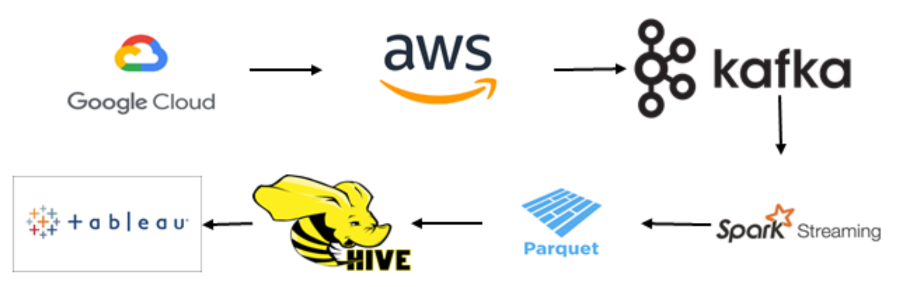
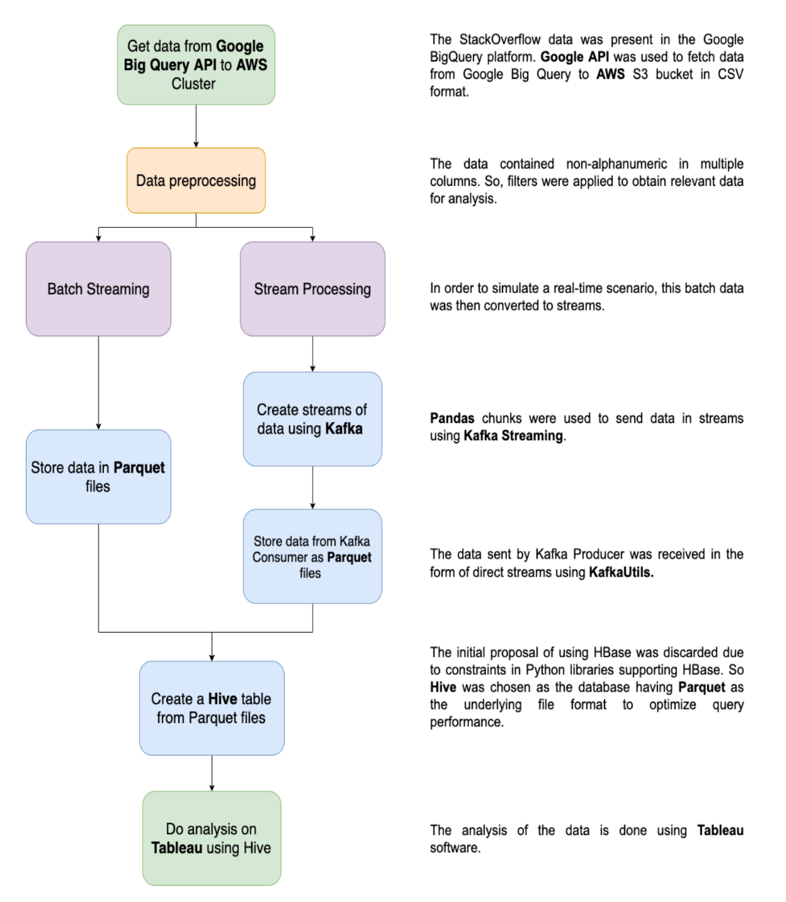

# Unstack the “Big Stack”

The objective of the project is to engineer Stack Overflow website’s real-time data with streaming and do some analysis to visualize some of the interesting trends.

Started in 2008, the popular site, Stack Overflow, has huge amounts of data that need to be handled and processed at a continuous rate. It is a very widely used question and answer forum for professional and enthusiastic programmers. A post can be a question, an answer to a question or comments on other posts. Posts contain various attributes like tags, upvotes, downvotes, views, etc. Users of Stack Overflow are encouraged to participate on the website to post quality questions and answers and are awarded reputation scores and badges. Such features help employers identify potential developers on the site for a particular technology. 

The project provides some intetesting trends and insights of Stack Overflow website. 

## Team Members:
1. Ankita Kundra
2. Gayatri Ganapathy
3. Kunal Niranjan Desai
4. Ria Gupta

## Data Pipeline

## Project Working

## Data
https://bigquery.cloud.google.com/dataset/bigquery-public-data:stackoverflow

## Tableau link to our project:
https://public.tableau.com/views/StackOverflow_Analysis/UserAnalysis?:display_count=y&publish=yes&:origin=viz_share_link

## Steps to run the project:

1. Use the Google Big Query API to query the data from Bigquery Dataset.
2. Upload the files onto Amazon S3 bucket and set up the Amazon EMR.
3. Use startup.sh to set up the environment in AWS CLI.
4. Run table_name_producer.py and table_name_stream.py to run the Kafka producer and consumer process.
5. See if Parquet files are formed in the cluster under the specified location.
6. Use Tableau link above to visualize the analysis made on the data.

